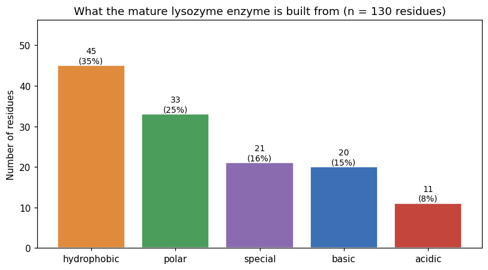
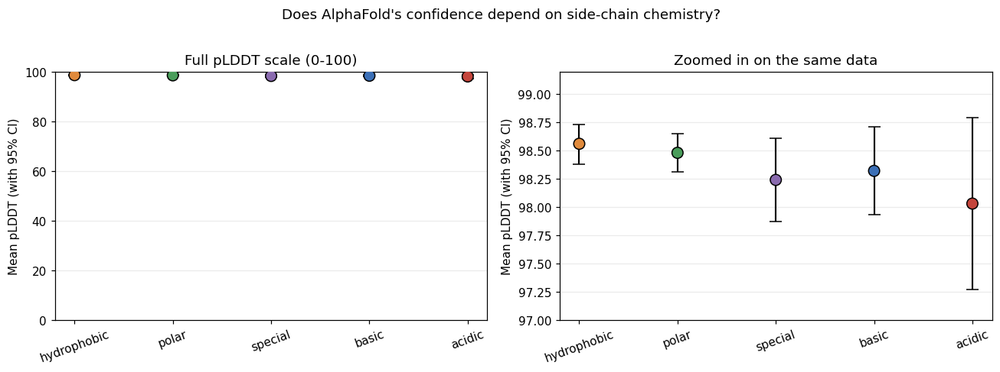
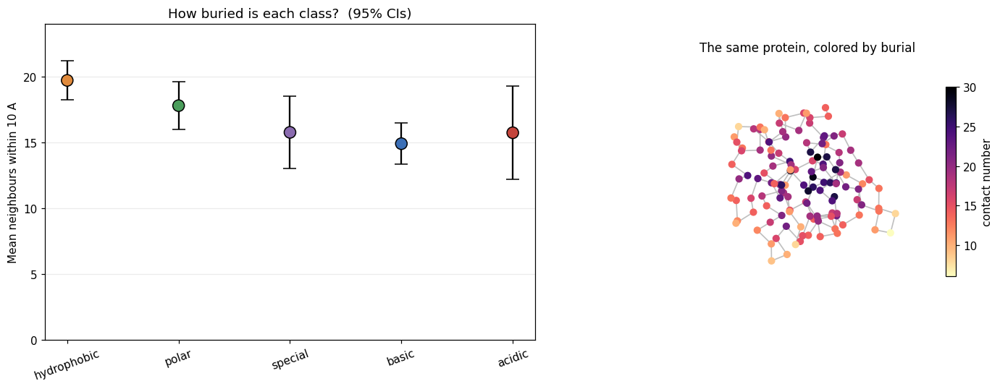
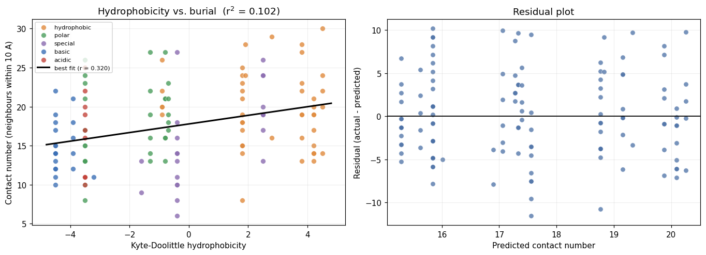
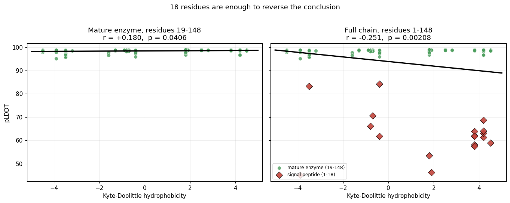
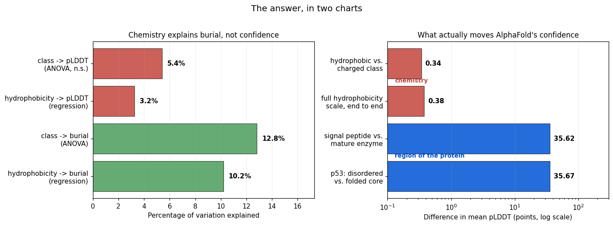

# AlphaFold Confidence Score Analysis — Human p53 (TP53)

Fetches AlphaFold's precomputed prediction for human p53 (UniProt `P04637`) from
the [AlphaFold Protein Structure Database](https://alphafold.ebi.ac.uk/) and
analyzes/visualizes its confidence metrics:

- **pLDDT** — per-residue confidence (0-100)
- **PAE** — predicted aligned error between residue pairs

## Research question

**Does AlphaFold's per-residue confidence score (pLDDT) track real, experimentally-verified
protein disorder — and does that relationship hold generally, beyond a single protein?**

- **H1 (single-protein):** within p53, residues in experimentally-characterized disordered
  regions have significantly lower pLDDT than residues in the folded domains.
- **H2 (generalization):** across a panel of proteins with independently-verified disorder
  (from [DisProt](https://disprot.org/)) vs. proteins with no documented disorder, low pLDDT
  predicts disorder status better than chance.

Both hypotheses are tested against DisProt as an independent ground truth, not just inferred
from visual inspection of one protein.

## Contents

- `alphafold_confidence_analysis.ipynb` — main notebook: fetches data via the
  AlphaFold DB API, computes summary statistics and confidence intervals on
  pLDDT (overall and per structural domain), and visualizes:
  - per-residue pLDDT along the sequence with AlphaFold's confidence bands
  - a PAE heatmap
  - the 3D structure colored by pLDDT
- `amino_acid_chemistry_confidence.ipynb` — a second, self-contained notebook written
  for an AP Biology / AP Chemistry reader: asks whether a residue's side-chain
  chemistry explains how confidently AlphaFold models it, using introductory-level
  statistics (confidence intervals, *t*-tests, ANOVA, chi-square, regression).
  Subject protein is human lysozyme (`P61626`), with p53 as a contrast case.
  Ten sections, each introducing one statistical tool and closing with a
  limitations section. **Walkthrough below.**

## Setup

```
pip install -r requirements.txt
jupyter notebook alphafold_confidence_analysis.ipynb
```

---

# `amino_acid_chemistry_confidence.ipynb` — a walkthrough

**The question:** every protein is a chain of amino acids, and each amino acid has a
side chain with its own chemistry — greasy, water-loving, acidic, or basic. Does that
chemistry explain how confident AlphaFold is about where each amino acid sits?

**The short answer:** no — but the investigation of *why not* turns out to be more
interesting than a yes would have been.

The subject is **human lysozyme** (UniProt `P61626`), the enzyme in your tears and
saliva that punches holes in bacterial cell walls. It's 148 amino acids long, and the
first 18 of those are a "signal peptide" — a shipping label the cell cuts off once the
protein has been delivered. That detail matters later.

## What we did, step by step

1. **Downloaded the prediction.** Asked the AlphaFold database for its model of human
   lysozyme and pulled out two things: the 3D coordinates of every atom, and the
   **pLDDT** score for every amino acid — AlphaFold's own 0–100 rating of how sure it
   is about that position. Everything is cached to `data/`, so the notebook re-runs
   identically offline.
2. **Built a chemistry table.** For all 20 amino acids, recorded the side-chain class
   (hydrophobic / polar / acidic / basic / special), the Kyte–Doolittle hydrophobicity
   score, molecular weight, and charge at pH 7 — then joined that onto every position
   in the protein. Now every amino acid in the chain carries both its chemistry and
   its confidence score.
3. **Looked before testing.** Charted what the enzyme is built from, and plotted
   confidence against chemistry, before running a single statistic.
4. **Tested the hypothesis** that greasy amino acids get higher confidence than
   charged ones — first with a *t*-test on two groups, then with ANOVA across all five
   classes at once.
5. **Measured burial from the actual coordinates.** For each amino acid, counted how
   many neighbours sit within 10 Å of it. A high count means it's packed in the core;
   a low count means it's out on the surface. This is a stand-in for "how buried is
   it," computed from the structure file rather than looked up.
6. **Tested chemistry against burial** with ANOVA, then with a chi-square test on a
   simple 2×2 table (greasy vs. not × buried vs. exposed).
7. **Ran regressions** to ask *how much* of the variation each relationship actually
   explains, not just whether it's real.
8. **Checked our own work** by re-running the analysis with the signal peptide added
   back in — and watched the answer flip.

## What the data showed

### The protein is mostly grease, as expected



35% of the mature enzyme is hydrophobic — the single largest class. That's the
hydrophobic effect at the level of the parts list: to fold in water, a protein needs
enough greasy pieces to build an oily core.

### But chemistry does not move the confidence score



The left panel is the honest one: on the scale AlphaFold actually uses, all five
classes land on the same flat line near 98. The right panel zooms in hard enough to
see the differences — and they span **less than one point**. The error bars overlap.
ANOVA agrees: *F* = 1.79, *p* = 0.136, η² = 0.054. Our hypothesis is dead, four
sections in.

That's not a failure of the analysis. It's a real result, and the notebook keeps going
to find out what's behind it.

### Chemistry *does* control where an amino acid sits



Switch the outcome from confidence to burial and the signal appears immediately.
Hydrophobic residues average ~20 neighbours within 10 Å; basic and special residues
average ~15, and the error bars separate. ANOVA: *p* = 0.0017, η² = 0.128. The 2×2
chi-square is blunter still — *p* = 0.0030, **odds ratio 3.31**: a hydrophobic amino
acid is about 3.3× more likely to be buried than a non-hydrophobic one.

The right-hand plot is the same finding without any statistics: dark (buried) points
cluster in the middle, light (exposed) points ring the outside. That's a protein core,
recovered from a downloaded coordinate file.

### Real, but small



Regression puts a number on it: *r* = +0.320, *p* = 0.0002 — but *r²* = 0.102, so
hydrophobicity explains only **10% of the variation** in burial. The other 90% is
everything the notebook didn't measure: position in the chain, secondary structure,
which neighbours a residue happens to have. Significant and small are not the same
claim, and the residual plot on the right confirms a straight line is a fair fit —
no curved pattern left over.

### The trap: 18 amino acids reverse the conclusion



Run the chemistry-vs-confidence regression on the mature enzyme and the slope is
slightly **positive** (*r* = +0.180, *p* = 0.041). Add back the 18-residue signal
peptide and it turns **negative** (*r* = −0.251, *p* = 0.002). Same protein, same
method, opposite conclusion — and both are "statistically significant."

The red diamonds explain it. The signal peptide is both unusually greasy *and*
floppy, so it scores low on pLDDT. It doesn't sit on the trend; it drags a line
through two separate populations. This is **Simpson's paradox**, and it's the reason
the notebook defined "mature enzyme = residues 19–148" up front instead of after
seeing results. The notebook then reproduces the same trap in p53, to show it wasn't
a lysozyme quirk.

### Putting it together



The left panel is the whole story in one chart. Chemistry → burial (green) explains
10–13% of the variation. Chemistry → confidence (red) explains 3–5%, and neither is
significant once you look at the effect size.

The right panel says why. Moving across the *entire* hydrophobicity scale changes
pLDDT by **0.38 points**. Moving from a folded region to a disordered one changes it
by **~36 points** — roughly **95× more**.

## The interpretation

Chemistry genuinely determines *where* an amino acid ends up in the fold. That part of
the hypothesis held up strongly. What broke is the next link in the chain: burial was
supposed to lead to confidence, and in this protein it can't, because **every residue
in the folded enzyme already scores 95–99**. Lysozyme is small, rigid, and heavily
represented in the structural data AlphaFold learned from. There is no variation in
pLDDT left for chemistry to explain — a ceiling effect.

What actually drives pLDDT isn't the chemistry of a single amino acid. It's whether
that stretch of protein has a fixed shape at all. That's the same conclusion the p53
notebook reaches from the opposite direction, and the two results agree.

## Limitations we're up front about

The notebook closes with seven, including: this is **one easy protein**; lysozyme
structures are in AlphaFold's training data, so there's mild circularity; contact
number is a *proxy* for burial (solvent-accessible surface area is the real measure);
and **seven tests were run without a multiple-comparison correction** — a Bonferroni
threshold of 0.05/7 ≈ 0.007 would strip the *p* = 0.041 result of its significance.
Nothing here is causal. Section 10 lists four concrete follow-ups, including re-running
the analysis on a protein whose pLDDT actually varies.

## Running it

```
pip install -r requirements.txt
jupyter notebook amino_acid_chemistry_confidence.ipynb
```

Sections 6 and 7 render interactive 3D structures with `py3Dmol`; those need a live
Jupyter session to spin. Everything else works from the cached files in `data/`.
