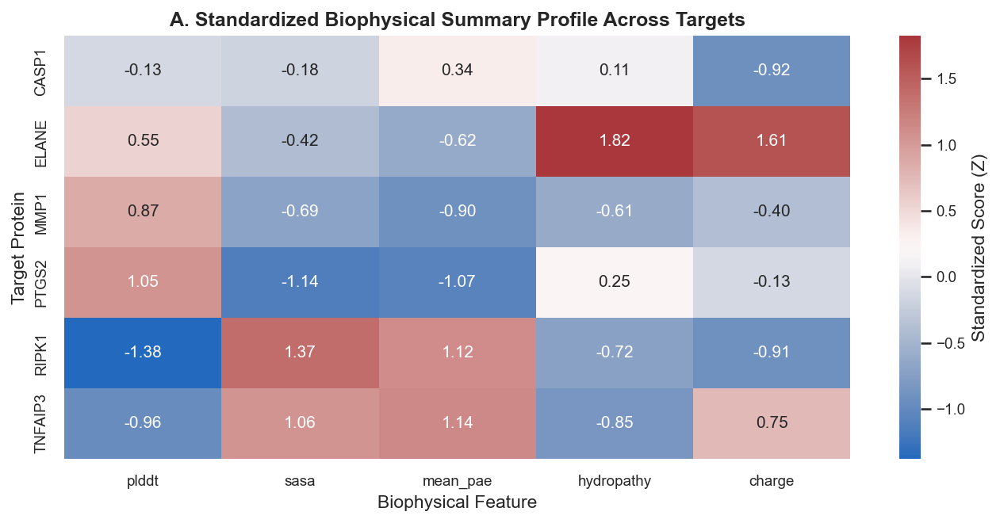
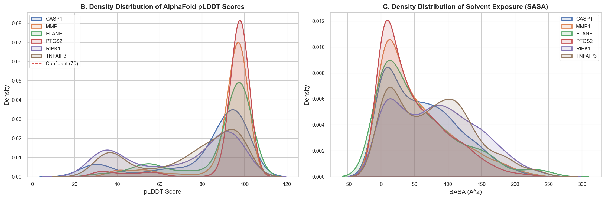
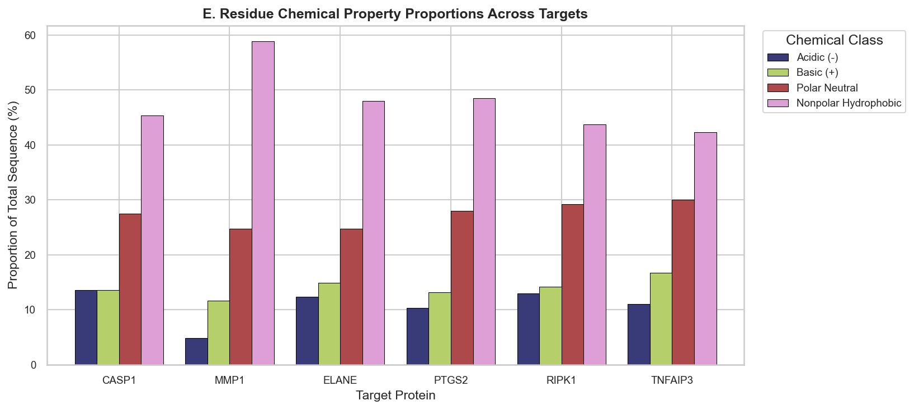
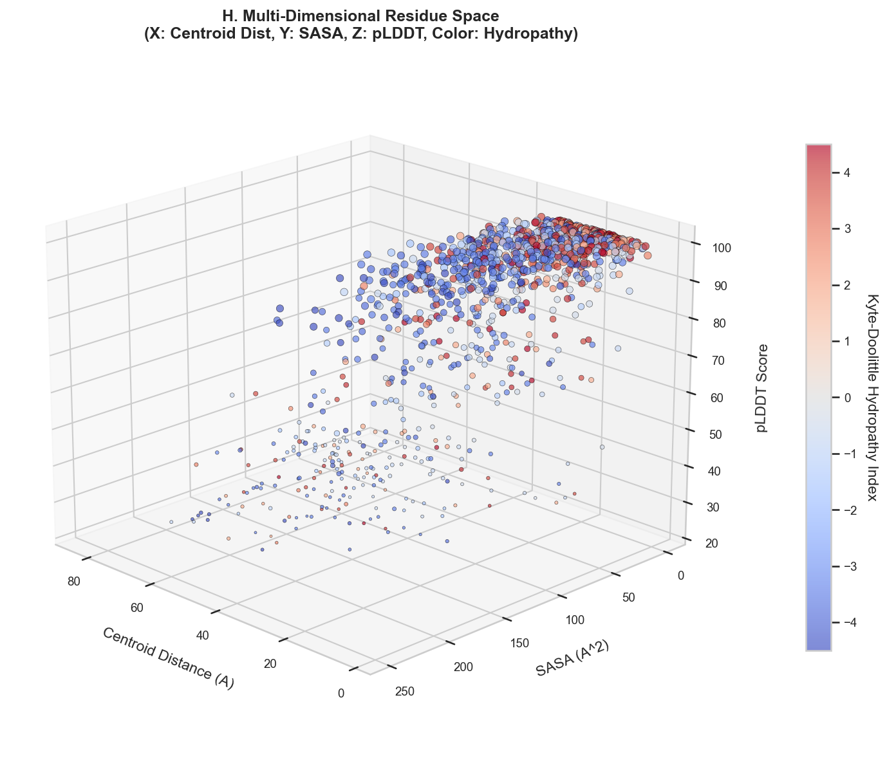
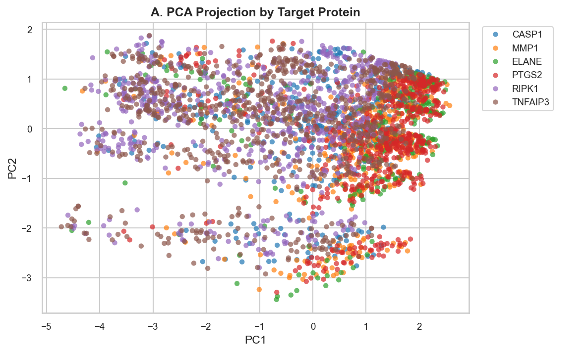
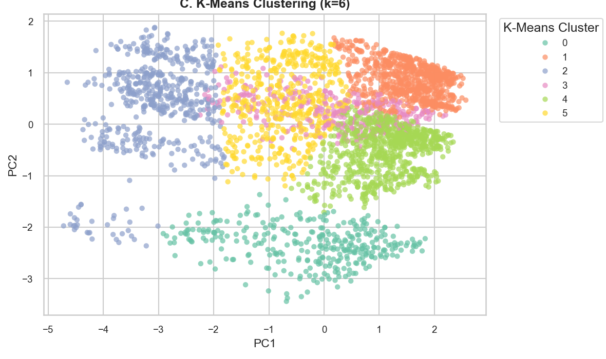
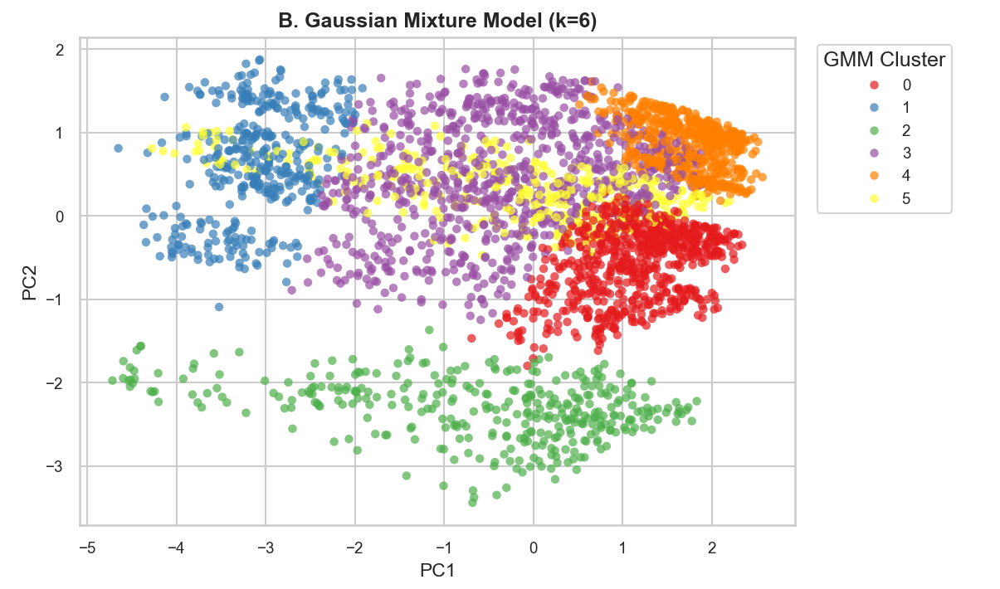
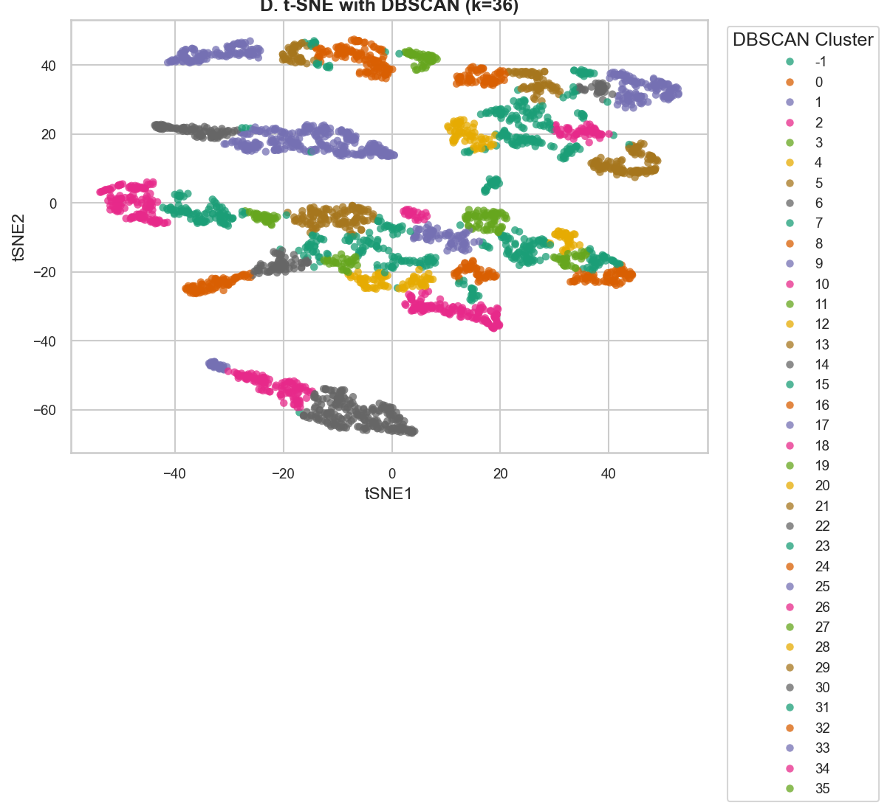

# Analysis on Acne Enzymes

In this report, I have conducted research using Alphafold- an AI protein structure tool- to determine how acne is related to inflammasomes in the skin. The specifics of the analysis I completed can be found in the acne folder. I became interested in this topic after I realized I was experiencing acne breakouts at 15 and have been curious about the underlying biological mechanisms ever since. 

## Goal of the Study

The goal of this report is to take a simple approach with alphafold to determine how certain enzymes relate to a target enzyme (Caspase-1). The reason for choosing Caspase-1 is because this enzyme plays a key role of inflammation in acne. The enzymes I chose to compare Caspase-1 to are MMP1, ELANE, PTGS2, RIPK1, and TNFAIP3. Along with Caspase-1, these five enzymes were selected because they represent each key stage of acne, from initial inflammation and tissue breakdown to the body's natural healing response. The goal is to use simple statistical methods to visualize and analyze how these enzymes relate to the target enzyme Caspase-1 structurally and biochemically.

## Data Extraction

The data fetched for these six enzymes comes from Alphafold database. This database contains the following features for each enzyme:
- pLDDT: scores how confident AlphaFold is in the 3D shape of each amino acid
- Mean PAE: Estimates how accurately two different parts of the protein are positioned together
- C-alpha Coordinates: The 3D coordinates marking where each amino acid sits in physical space
- Distance to Centroid: How far an amino acid is from the center of the protein.
- SASA: Measures how much of an amino acid touches the surrounding fluid
- Hydropathy: Shows whether an amino acid prefers water or hides inside oily pockets
- Charge: The electrical charge carried by an amino acid inside human skin cells

To parse and extract data from the database, I used python and python libraries such as Pandas, NumPy, and Biopython. 

## Summary Statistics

Below are the numerical outputs from my Python analysis, along with explanations of what the numbers tell us about each enzyme.

### 1. Overall Physical Measurements
```text
Comprehensive Biophysical Summary Statistics:
         residue_count  plddt_mean  plddt_std  plddt_median  plddt_iqr  plddt_skew  sasa_mean  sasa_std  sasa_median  sasa_iqr  pae_mean  pae_std
protein                                                                                                                                          
CASP1              404       81.68      22.61         91.38      17.16       -1.48      61.02     52.79        53.09     88.51     17.28     6.41
ELANE              267       88.20      17.96         97.50       8.34       -1.72      57.79     58.89        39.27     80.85      9.87     7.90
MMP1               469       91.22      14.96         97.00       4.57       -2.53      54.10     52.41        37.57     74.12      7.72     6.76
PTGS2              604       93.02      15.28         98.00       1.89       -3.14      48.14     48.11        32.94     68.58      6.47     6.66
RIPK1              671       69.74      25.29         80.38      51.03       -0.44      81.97     60.28        79.64     95.70     23.26     4.96
TNFAIP3            790       73.73      23.49         81.97      41.40       -0.66      77.74     58.35        77.30     93.84     23.42     5.56
```
**What this means:** Enzymes that actively break down tissue or make swelling molecules (like PTGS2, MMP1, and ELANE) are rigid and tightly packed, which gives them very high AlphaFold accuracy scores (average pLDDT above 88). On the other hand, enzymes such as RIPK1 and TNFAIP3 have looser, floppy sections that touch more fluid, so AlphaFold gives them lower confidence scores (~70–74). Caspase-1 sits right in the middle.

---

### 2. AlphaFold Confidence Tiers (% of Amino Acids in Each Score Bracket)
```text
Structural Confidence Tier Distribution (% per enzyme):
confidence_tier  Very High (>=90)  Confident (70-90)  Low (50-70)  Very Low (<50)
protein                                                                          
CASP1                        56.7               21.3          8.2            13.9
ELANE                        75.7                7.5         10.9             6.0
MMP1                         85.1                4.3          5.8             4.9
PTGS2                        90.7                0.8          3.1             5.3
RIPK1                        32.2               26.5         10.4            30.8
TNFAIP3                      35.4               30.1         10.1            24.3
```
**What this means:** Over 75% to 90% of the building blocks in PTGS2, MMP1, and ELANE earned very high confidence ($\geq 90$). On the other hand, RIPK1 and TNFAIP3 have around 25% to 30% low-confidence regions. This makes sense because those flexible loops need to bend and move to interact with other cell parts.

---

### 3. Chemical Makeup of the Building Blocks
```text
Residue Chemical Property Distribution (% per enzyme):
chemical_class  Acidic (-)  Basic (+)  Polar Neutral  Nonpolar Hydrophobic
protein                                                                   
CASP1                 13.6       13.6           27.5                  45.3
ELANE                  4.9       11.6           24.7                  58.8
MMP1                  12.4       14.9           24.7                  48.0
PTGS2                 10.3       13.2           28.0                  48.5
RIPK1                 13.0       14.2           29.2                  43.7
TNFAIP3               11.0       16.7           30.0                  42.3
```
**What this means:** About half (42% to 59%) of every enzyme is made of oily, hydrophobic building blocks that hide on the inside to keep the protein folded. The remaining pieces are charged (positive or negative) or polar, sitting on the outside like magnets to touch watery skin tissue and bind to other molecules.

---

### Visualizations


*Figure 1: Comparison heatmap showing how each enzyme scores (above or below average) across size, shape accuracy, water contact, and electrical charge.*


*Figure 2: Bell-curve graphs showing that rigid enzymes have a sharp peak at high AI confidence (left), while floppy switch enzymes spread out and touch more water (right).*


*Figure 3: Side-by-side bar chart showing that all six acne enzymes use roughly the same proportion of oily, charged, and neutral building blocks.*


*Figure 4: 3D map showing how building blocks naturally sort themselves: oily amino acids cluster in the center with high AI confidence, while water-loving pieces stay on the outside.*

## Hypothesis Tests & Confidence Intervals

In this section, statistical tests were conducted to answer a practical biological question: **Do destructive acne enzymes have a different surface water-attraction (hydropathy) than protective anti-inflammatory enzymes?**

### 1. Two-Sample Comparison: MMP-1 (Destructive) vs. A20/TNFAIP3 (Protective)
I compared the surface amino acids of **MMP-1** (which breaks down collagen) against **A20/TNFAIP3** (which halts inflammation):
- **Hypothesis**: The null hypothesis ($H_0$) states that both enzymes have the same average surface water-attraction. The alternative hypothesis ($H_a$) states their surface chemical properties differ.
- **Welch's Two-Sample t-Test**:
  - $t = -1.0267$, $p\text{-value} = 0.3049$
  - Difference in Means: $-0.197$
  - **95% Confidence Interval**: $[-0.5739, +0.1804]$
- **Non-Parametric Tests (Mann-Whitney U & Kolmogorov-Smirnov)**:
  - Mann-Whitney $U = 89,965.5$, $p\text{-value} = 0.4119$
  - Kolmogorov-Smirnov $D = 0.0617$, $p\text{-value} = 0.3997$

**Significance:** Because the $p$-value is much greater than $0.05$ and the 95% confidence interval crosses zero, there is **no statistically significant difference** in surface water-attraction between destructive and protective enzymes. Both types of proteins expose similar chemical surface environments to the surrounding skin fluid.

---

### 2. Cohort-Wide Test Across All Six Enzymes
I then tested whether surface water-attraction varies when looking at all six enzymes at the same time:
- **One-Way ANOVA**: $F = 2.3442$, $p\text{-value} = 0.0392$
- **Kruskal-Wallis Test**: $H = 8.5343$, $p\text{-value} = 0.1291$

**Significance:** While parametric ANOVA shows a slight difference driven by specialized binding patches in individual enzymes, the overall non-parametric distribution shows that surface chemistry remains broadly uniform across the acne pathway.

---

## Linear Regression: What Drives Surface Exposure?

A multiple linear regression model was trained on the target enzyme **Caspase-1** to determine which physical rules dictate whether an amino acid stays buried inside or gets pushed to the watery outer surface (Solvent Accessible Surface Area, or SASA).

### Model Performance & Key Findings
- **Explained Variance ($R^2$)**: $0.498$ (adjusted $R^2 = 0.491$, $F = 78.88$, $p = 2.30 \times 10^{-57}$). Roughly **50% of the variation** in surface exposure is explained by basic physical rules. This value is somewhat low, suggesting that other factors not included in the model may also play a role in determining surface exposure.
- **Standardized Predictor Strengths (Ridge & Lasso Regression)**:
  1. **AlphaFold Confidence (pLDDT: $\beta \approx -23.71$)**: Higher confidence strongly predicts buried, tightly packed residues. Flexible outer loops have lower confidence.
  2. **Water-Phobia (Hydropathy: $\beta \approx -18.70$)**: Oily, hydrophobic amino acids are driven into the protein interior to hide from fluid.
  3. **Distance from Core (Centroid Distance: $\beta \approx +14.17$)**: Amino acids located farther from the protein's center are naturally exposed on the outside.
  4. **Electrical Charge ($\beta \approx +3.49$)**: Charged residues prefer the exterior where they can interact with water.

**Significance:** Protein folding in acne enzymes follows intuitive physics: hydrophobic amino acids tuck into the rigid core (high AlphaFold confidence), while charged, flexible loops stay exposed on the surface.

---

## Machine Learning & Clustering

Using unsupervised machine learning, all 3,205 amino acids across the six enzymes were grouped based on their spatial position, chemical charge, water preference, and structural confidence.

### 1. Principal Component Analysis (PCA)
- High-dimensional data was simplified into core directions of variation:
  - **PC1 (49.3% of variance)**: Represents core burial vs. surface solvent exposure.
  - **PC2 (19.3% of variance)**: Captures chemical hydropathy and electrical charge.
  - **PC3 (15.8% of variance)**: Reflects AlphaFold prediction uncertainty.
  - **Cumulative Variance**: The top 3 components capture **84.4%** of all structural information.


*Figure 5: PCA compresses all structural measurements into a 2D map, showing that amino acids from all six enzymes overlap in the same physical space instead of separating by enzyme.*

### 2. K-Means Clustering
- **K-Means Clustering ($k = 6$, Silhouette Score = $0.437$)**: Groups amino acids into distinct functional micro-environments (e.g., rigid hydrophobic core, flexible outer loop, active binding cleft).


*Figure 6: K-Means divides the amino acids into six distinct zones based on their physical role, cleanly separating buried structural cores from exposed outer surfaces.*

### 3. Gaussian Mixture Models (GMM)
- **Gaussian Mixture Models (GMM: $k = 6$, Silhouette Score = $0.361$)**: Confirms six natural probabilistic structural states across the proteins, allowing for fuzzy transitions between flexible and rigid zones.


*Figure 7: GMM groups the building blocks by statistical probability, showing how different protein parts smoothly transition between rigid cores and flexible loops.*

### 4. Density-Based Clustering (DBSCAN)
- **DBSCAN (Density-Based: 36 dense micro-clusters, 350 outliers)**: Identifies tightly packed structural motifs while isolating disordered linker residues.


*Figure 8: DBSCAN pinpoints 36 dense, tightly packed structural clusters while flagging loose, floppy linker regions as outliers (shown in grey).*

**Significance:** Residues group by their **biophysical job** (such as forming a rigid structural skeleton or an interactive outer surface) rather than which specific enzyme they belong to. All six enzymes share the same modular building blocks.

---

## Conclusion
